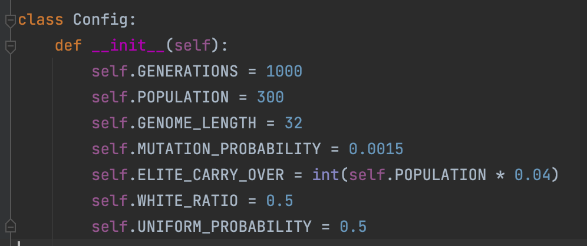

## Genetic Algorithms and Image Reconstruction: How Different Recombination Mechanisms Impact Algorithmic Performance

> This project was part of my Computer Science MSc course at Birkbeck, UoL.
> It was the final project submitted as part of my final dissertation. 
> As such this project is by far finished, and it was only the basis and introduction
> to the topic. Please check `msc-report.doc` for the dissertation and the 
> logic behind the decisions I made.

A search-based technique known as a genetic algorithm is used to address optimization
issues in machine learning. The field of picture reconstruction is just one where these
algorithms have been applied. To tackle the issue of image reconstruction, researchers
have employed a wide variety of machine learning algorithms. Even those who have used
genetic algorithms for this goal have employed various operators resulting in a wide
range of outcomes. The goal of this project is to completely implement a genetic
algorithm in Python for the purpose of reconstructing binary images. The effects
of three different recombination, or crossover,  methods –namely the single-point,
double-point, and uniform crossover methods—will be analysed on algorithmic performance.

### Key features
The way I've structured this project it provides two key features:
1. generate binary images per X number of generations (this depends on how often we want
images saved, e.g., save one image per 10 generations). For this feature I used the Python
Imaging Library (`PIL`).
2. generate graphs that depict the fitness/performance of the population using the
specified crossover method. For this feature I used the `matplotlib` library.

### Getting started
First you need to provide the algorithm with a binary image (i.e., black and white) as the
original image (`original_image.png`). This will be the expected result (aka maximum fitness
to be reached by the population). You can use any *simple* image for this purpose, and convert that 
to binary black and white using any program you like, I used Photoshop. Then we generate a random
binary image with the same dimensions. The algorithm will try to reconstruct the original image from
the random generated image.

There are two files the user needs to check to run the algorithm.
- The first file is `config.py`:

In this file, the user can set the parameters under which the algorithm will run (please
check section 5.2 Parameter Configuration in my report for more details).

- The second file is `algorithm.py`. This is where all the magic happens 🪄 Run this file and the
algorithm will start running in the terminal. Indicative messages will be printed. As the algorithm
stands now, it will run three times, once for each crossover method.
>Please note that the part of the code that generates the graphs is commented out
>`create_plot(generation_list, fitness_list, crossover_operator)`

